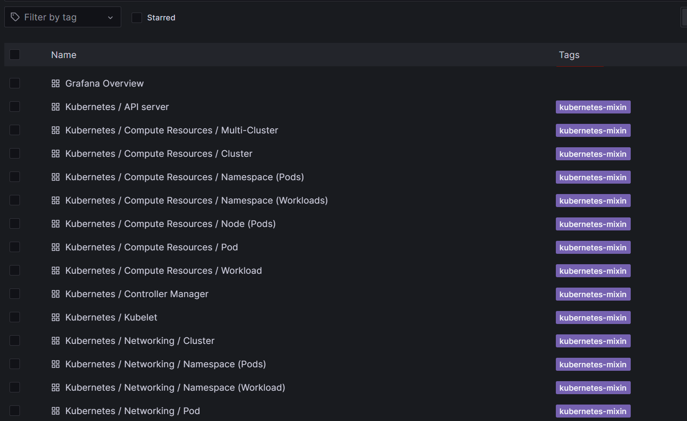

# ДИПЛОМНАЯ РАБОТА ПО КУРСУ "DEVOPS-ИНЖЕНЕР"

# Дипломная работа
---
## Цели:

1. Подготовить облачную инфраструктуру на базе облачного провайдера Яндекс.Облако.
2. Запустить и сконфигурировать Kubernetes кластер.
3. Установить и настроить систему мониторинга.
4. Настроить и автоматизировать сборку тестового приложения с использованием Docker-контейнеров.
5. Настроить CI для автоматической сборки и тестирования.
6. Настроить CD для автоматического развёртывания приложения.
---
## Этапы выполнения:

1. Создаем сервисный аккаунт, который будет в дальнейшем использоваться Terraform для работы с инфраструктурой с необходимыми и достаточными правами. 
   Подготавливаем для Terraform:  S3 bucket в созданном ЯО аккаунте(создание бакета через TF)

 - Создаем сервисный аккаунт (terraform-sa) "Service account for Terraform".
 - Назначаем роли IAM для этого аккаунта:
      Роль editor для управления ресурсами в папке.
      Роль storage.admin для управления объектным хранилищем.
 - Создаем статический ключ доступа для сервисного аккаунта, который используется для аутентификации при работе с Yandex Object Storage.
 - Создаем бакет Object Storage (mtfstate-cluster) для хранения состояния Terraform. Ключи доступа (access_key и secret_key) используются для доступа к бакету.
 - Создаем реестр контейнеров (my-nginx-registry) для хранения Docker-образов [Yandex Container Registry](https://cloud.yandex.ru/services/container-registry).
[Код Terraform](https://github.com/martishinid/diplom/tree/main/terraform-init)


## Подготовка инфраструктуры terraform

1. Создание каталога в Яндекс.Облаке (значение `folder_id`)

2. Добавление прав доступа к каталогу для существующего сервисного аккаунта с правами: `compute.editor`, `editor`, `iam.admin`, `kms.admin`, `kms.keys.encrypterDecrypter`, `resource-manager.admin`, `storage.admin`, `load-balancer.admin`.

3. Запуск предварительной настройки terraform от имени указанного сервисного аккаунта

    1. Создать файл `secret.auto.tfvars` и добавить значение переменных `token`, `cloud_id`, `folder_id` ([terraform-init/variables.tf](terraform-init/variables.tf#L5))

    2. _(при необходимости)_ Изменить значения переменных в файле [terraform-init/variables.auto.tfvars](terraform-init/variables.auto.tfvars)

    3. Выполнить команду запуска

      ```
        terraform -chdir=./terraform-init apply -var-file=../secret.auto.tfvars

      ```

4. Получение файла с ключами от созданного в п.3 сервисного аккаунта

    ```
    yc iam key create --output terraform-main/sa_key.json --service-account-name=terraform-sa --folder-id=<folder-id>
    ```

5. Инициализация основного проекта terraform (добавление учетных данных созданного сервисного аккаунт, и настройка хранения файла состояния .tfstate в объектном хранилище Яндекс Облака)

    ```
    terraform -chdir=./terraform-main init -backend-config=backend.secret.tfvars -reconfigure
    ```

6. Запуск создания основной инфраструктуры

    ```
    terraform -chdir=./terraform-main apply -var-file=../secret.auto.tfvars
    ```

    _Установка кластера занимает ~25 минут._

7. Изменение конфигурационного файла кластера по пути `~/.kube/config` - файл создаётся автоматически

    ```
    nano ~/.kube/config
    ```

    В файле необходимо заменить IP-адрес подключения на внешний IP-адрес балансировщика нагрузки и порт подключения на внешний порт. информация отображается в выходных данных terraform-main

    
8. Проверка работы кластера осуществляется командой

    ```
    kubectl get nodes
    ``` 


## 2. Установка Prometheus, Grafana, Node Exporter

Для установки Prometheus, Grafana, AlertManager используется helm-сборка `kube-prometheus-stack`. Установка осуществляется в main terraform-проекте [kube-prometheus](terraform-main/kube-prometheus/main.tf) с использованием провайдера `helm` [terraform-main/kube-prometheus/providers.tf](terraform-apps/providers.tf).

Конфигурационный файл - [terraform-main/kube-prometheus/kube-prometheus-values.yaml](terraform-main/kube-prometheus/kube-prometheus-values.yaml).

Для запуска проекта необходимо выполнить команды:

```
terraform -chdir=./terraform-main init -backend-config=backend.secret.tfvars -reconfigure
terraform -chdir=./terraform-main apply -var-file=../secret.auto.tfvars
```

__Результат:__

Созданное пространство имен `namespace`, в котором развернуты поды и службы Prometheus.


Созданные контейнеры, службы, приложения


Таким образом, Grafana доступна по `<external-app-IP>` и порту `80`.




## 3. Настройка CI/CD terraform-проекта

Для настройки CI/CD была подготовлена при помощи terraform виртуальная машина с установленным Gitlab, куда был импортирован текущий проект из github.
terraform-проект [gitlab](gitlab)

# ⚙️ Настройка Pipeline

## Ожидаемый результат

- Интерфейс CI/CD GitLab-сервиса доступен по адресу:  
  [http://158.160.38.199/](http://158.160.38.199/)
- При **любом коммите** в репозиторий с тестовым приложением:
  - Происходит **сборка Docker-образа**
  - Отправка в **Docker-регистр**
- При **создании тега** (например, `v1.0.0`):
  - Сборка и отправка Docker-образа с соответствующим **лейблом**
  - **Деплой** Docker-образа в кластер **Kubernetes**

1. **Импорт проекта из GitHub**

2. **Настройка CI/CD**
   1. **Файл [.gitlab-ci.yml](.gitlab-ci.yml)**
      - Создание Runners для выполнения кода Terraform
      - Этапы:
        - `validate`
        - `plan`
        - `apply`
        - `destroy`
      - Обработчики для каждого этапа с вызовом `terraform ...`

   2. **Файл [.gitlab-ci.yml](nginx-app/.gitlab-ci.yml)**
      - Этапы:
        - `build`
        - `deploy`

### build
- Используется образ **Kaniko** для сборки и пуша Docker-образа.
- Логин в **Yandex Container Registry** через создание конфигурации Docker.
- Kaniko собирает образ и пушит его с тегом `commit short SHA`.
- Выполняется **всегда**, кроме случаев, когда используется **тег** (в этом случае пропускается).

---

### build_tag
- То же самое, что и `build`, но:
  - Пушит образ с тегом `CI_COMMIT_TAG`.
- Выполняется **только**, если есть **тег коммита** (release/tag build).

---
### deploy
- Используется образ **kubectl** от **Bitnami**.
- Настраивается `kubectl` через переменные `$KUBE_URL` и `$KUBE_TOKEN`.
- В манифест `deployment.yaml` подставляется тегированный Docker-образ.
- Применяются манифесты в Kubernetes: `deployment` и `service`.
- Выполняется **только**, если есть **тег**.
3. Добавление необходимых переменных, содержащих ключевую и парольную информацию, а также переменные из [secret.auto.tfvars](secret.auto.tfvars)

    Файл `sa_key.json` предварительно был закодирован base64 и скопирован в переменную `$YC_KEY`.

    Требуется дописать вручную переменные `bucket`, `region`, `key` в файле [terraform-main/backend.tf](terraform-main/backend.tf).

    


4. Изменение кода проекта и анализ проработки pipeline

    

    - этап `Build`

    

    - этап `validate`

      

5. Тестовое приложение nginx представлено в докере в файле [Dockerfile](nginx-app/Dockerfile).
В результате в кластере kubernetes страничка [index.html](nginx-app/index.html) nginx доступная по 8000 порту (так как на 80 повесил графану)

------

## Полезные дополнительные материалы, которые пригодились для выполнения задания
[Yandex Container registry конфигурации сценария CI](https://yandex.cloud/ru/docs/managed-gitlab/tutorials/image-storage)

[Yandex  конфигурации сценария CI для Kubernetes - 1](https://yandex.cloud/ru/docs/tutorials/infrastructure-management/gitlab-containers#token_3)

[Yandex  конфигурации сценария CI для Kubernetes - 2](https://yandex.cloud/ru/docs/managed-kubernetes/operations/connect/create-static-conf#prepare-token)

[Установка kubernetes через kubespray - habr](https://habr.com/ru/articles/426959/)

[https://dev.to/admantium/kubernetes-installation-tutorial-kubespray-46ek?ysclid=m97m4b14sh390719292](https://dev.to/admantium/kubernetes-installation-tutorial-kubespray-46ek?ysclid=m97m4b14sh390719292)

[https://developer.hashicorp.com/terraform/language/resources/provisioners/remote-exec](https://developer.hashicorp.com/terraform/language/resources/provisioners/remote-exec)

[https://habr.com/ru/articles/725640/](https://habr.com/ru/articles/725640/)

[Шифрование бакета - Yandex.Cloud](https://yandex.cloud/ru/docs/storage/operations/buckets/encrypt)

[Yandex Storage Bucket](https://terraform-provider.yandexcloud.net/resources/storage_bucket#nestedblock--lifecycle_rule--transition)

[https://fauzislami.github.io/blog/2021/10/17/highly-available-kubernetes-cluster-with-haproxy-and-keepalived/](https://fauzislami.github.io/blog/2021/10/17/highly-available-kubernetes-cluster-with-haproxy-and-keepalived/)

[https://fauzislami.github.io/blog/2021/10/17/highly-available-kubernetes-cluster-with-haproxy-and-keepalived/](https://fauzislami.github.io/blog/2021/10/17/highly-available-kubernetes-cluster-with-haproxy-and-keepalived/)

[Atlantis](https://docs.vultr.com/run-terraform-in-automation-with-atlantis)

[https://habr.com/ru/articles/752586/](https://habr.com/ru/articles/752586/)

------

# Задание

[https://github.com/netology-code/devops-diplom-yandexcloud](https://github.com/netology-code/devops-diplom-yandexcloud)